# Little Phil Ignite - Four-Tier LLM Expert Team System

## Table of Contents
- [Overview](#overview)
- [Expert Team Structure](#expert-team-structure)
- [Team Coordination Matrix](#team-coordination-matrix)
- [Handoff Triggers & Protocols](#handoff-triggers--protocols)
- [Voice TTS/STT Integration Readiness](#voice-ttsstt-integration-readiness)
- [Quality Gates & Performance Metrics](#quality-gates--performance-metrics)
- [Crisis Management & Emergency Response](#crisis-management--emergency-response)
- [Continuous Improvement Framework](#continuous-improvement-framework)

## Overview

The Little Phil Ignite platform employs a **Four-Tier LLM Expert Team System** designed to ensure zero-defect development through specialized expertise, systematic coordination, and comprehensive quality assurance. This system evolved from addressing LLM reliability issues and the need for systematic bug prevention.

### Core Philosophy
- **Strategic Leadership**: Architect/CTO provides executive-level oversight
- **Specialized Expertise**: Each specialist handles their domain optimally
- **Systematic Coordination**: Clear handoff triggers prevent work loops
- **Zero-Defect Goal**: Multiple quality gates ensure code stability
- **Future-Ready**: Prepared for voice TTS/STT functionality expansion

## Expert Team Structure

### 🏗️ Architect/CTO (Strategic Commander)
**Role**: Executive technology leadership and team orchestration

**Core Responsibilities**:
- Strategic planning and architectural decisions
- Risk management and business alignment
- Team coordination and delegation
- Quality oversight and final approval
- Crisis management and incident response

**Decision Authority**:
- Technology stack choices
- Architecture patterns and standards
- Resource allocation and priorities
- Quality standards and processes
- Team escalation resolution

### 💻 Konverter Coder Specialist (Implementation Expert)
**Role**: Feature development and standard implementation

**Core Responsibilities**:
- Clean code implementation following specifications
- Atomic commit strategy with defensive development
- Documentation maintenance and synchronization
- Team coordination through proper escalation/delegation
- Security pattern implementation

**Expertise Areas**:
- Next.js 15 + React 19 + TypeScript development
- Database operations with Drizzle ORM
- API development and integration
- Multi-tenant architecture implementation
- Voice integration preparation (WebRTC, Voice APIs)

### 🪲 Debugger Specialist (Problem Solver)
**Role**: Complex issue resolution and system optimization

**Core Responsibilities**:
- Root cause analysis of complex bugs
- Performance optimization and bottleneck resolution
- Integration debugging and system stability
- Error pattern analysis and prevention
- Knowledge transfer and solution documentation

**Expertise Areas**:
- System-wide performance analysis
- Memory leak detection and optimization
- Integration failure diagnosis
- Database query optimization
- Voice processing latency issues

### 🧪 QA Tester Specialist (Quality Guardian)
**Role**: Comprehensive testing and quality assurance

**Core Responsibilities**:
- Quality gate enforcement before deployment
- Comprehensive testing strategy execution
- Performance benchmarking and validation
- Security vulnerability assessment
- User experience and accessibility verification

**Expertise Areas**:
- Automated testing frameworks
- Performance testing and benchmarking
- Security testing methodologies
- Multi-device and cross-browser testing
- Voice quality and tool use testing

## Team Coordination Matrix

### Delegation Decision Tree

```mermaid
graph TB
    A[Task Received by Architect] --> B{Task Analysis}
    B --> C{Task Type?}
    
    C -->|New Feature<br/>Standard Development| D[→ Konverter Coder]
    C -->|Production Bug<br/>Performance Issue| E[→ Debugger Specialist]
    C -->|Quality Verification<br/>Testing Required| F[→ QA Tester]
    
    D --> G{Implementation Status}
    G -->|Stuck >2hrs| H[↑ Escalate to Architect]
    G -->|Bug Found| I[→ Delegate to Debugger]
    G -->|Complete| J[→ Delegate to QA Tester]
    
    E --> K{Debug Status}
    K -->|Root Cause Found| L[→ Delegate fix to Konverter]
    K -->|Systemic Issue| M[↑ Escalate to Architect]
    K -->|Fix Ready| N[→ Delegate to QA Tester]
    
    F --> O{QA Results}
    O -->|Bugs Found| P[→ Delegate to Debugger]
    O -->|Quality Issues| Q[→ Feedback to Konverter]
    O -->|Quality Gate Failed| R[↑ Escalate to Architect]
    O -->|All Tests Pass| S[✅ Ready for Deployment]
```



### Cross-Specialist Handoff Matrix

| From ↓ \ To → | Architect/CTO | Konverter Coder | Debugger Specialist | QA Tester |
|---------------|---------------|-----------------|-------------------|-----------|
| **Architect/CTO** | - | Feature specs<br/>Architecture guidance | Bug investigation<br/>Performance analysis | Quality verification<br/>Testing strategy |
| **Konverter Coder** | Stuck >2hrs<br/>Scope changes<br/>Architecture conflicts | - | Complex bugs<br/>Performance issues | Feature complete<br/>Ready for testing |
| **Debugger Specialist** | Systemic issues<br/>Architecture problems | Simple fixes<br/>Implementation changes | - | Fix verification<br/>Regression testing |
| **QA Tester** | Quality gate failures<br/>Strategic quality issues | Quality feedback<br/>Minor fixes | Bug reports<br/>Performance issues | - |

## Handoff Triggers & Protocols

### Universal Escalation Triggers to Architect/CTO

**IMMEDIATE ESCALATION** (all specialists):
- **Scope Creep**: Requirements expanding beyond specification
- **Architecture Conflicts**: Implementation doesn't fit established patterns
- **Security Concerns**: Uncertain about security implementation approaches
- **Business Impact**: Changes affecting business logic or user experience
- **Timeline Impact**: Delays affecting project milestones
- **Quality Gate Failures**: Consistent failures in quality standards

### Specialist-Specific Handoff Triggers

#### Konverter Coder → Others
```markdown
**→ Debugger Specialist:**
- Complex bugs requiring >1 hour investigation
- Performance issues beyond simple optimization
- Integration failures with external systems
- Memory leaks or resource optimization needs
- Error patterns requiring systematic analysis

**→ QA Tester Specialist:**
- Feature implementation complete
- All unit and integration tests passing
- Self-testing completed successfully
- Documentation updated
- Ready for comprehensive quality verification

**→ Architect/CTO:**
- Blocked on implementation >2 hours
- Uncertain about architecture decisions
- Performance requirements cannot be met
- Security implementation approach unclear
```

#### Debugger Specialist → Others
```markdown
**→ Konverter Coder:**
- Root cause identified, simple fix needed
- Performance optimization approach defined
- Clear implementation path established
- Bug reproduction steps documented

**→ QA Tester Specialist:**
- Bug fix completed and ready for verification
- Performance optimization needs validation
- Regression testing required after fix
- System stability verification needed

**→ Architect/CTO:**
- Systemic architecture issues discovered
- Security vulnerabilities require strategic decisions
- Performance problems require infrastructure changes
- Multiple related issues indicating design problems
```

#### QA Tester Specialist → Others
```markdown
**→ Debugger Specialist:**
- Bugs discovered during testing
- Performance benchmarks not met
- Intermittent issues requiring investigation
- Security vulnerabilities detected

**→ Konverter Coder:**
- Minor quality issues and feedback
- Documentation gaps or inaccuracies
- UI/UX improvements needed
- Simple fixes for test failures

**→ Architect/CTO:**
- Quality gates consistently failing
- Testing strategy needs architectural review
- Security testing reveals systematic issues
- User experience problems requiring strategic decisions
```

## Voice TTS/STT Integration Readiness

### Strategic Preparation Framework

#### Architecture Considerations
- **Real-time Processing**: <500ms latency requirements
- **Multi-tenant Voice Data**: Isolated voice storage and processing
- **AI Model Coordination**: Voice AI + OpenAI integration
- **Tool Use Implementation**: Voice commands → platform actions
- **Security & Privacy**: Voice data encryption and compliance

#### Specialist Readiness Matrix

```markdown
### 🏗️ Architect/CTO Voice Preparation
**Strategic Planning**:
- Voice architecture integration with existing platform
- Voice data privacy compliance strategy
- Real-time processing infrastructure planning
- Tool use security and authorization framework

**Team Coordination**:
- Voice development workflow coordination
- Cross-specialist voice expertise development
- Voice quality standards and benchmarks
- Voice feature rollout and testing strategy

### 💻 Konverter Coder Voice Skills
**Technical Implementation**:
- WebRTC integration for real-time audio
- Voice API integration (Azure/Google/AWS Speech)
- Tool use API development and implementation
- Voice authentication and security flows
- Real-time data processing optimization

**Development Focus**:
- Low-latency audio processing
- Voice command parsing and execution
- Tool use result communication
- Voice data encryption implementation

### 🪲 Debugger Specialist Voice Expertise
**Problem Resolution**:
- Audio latency optimization and debugging
- Voice recognition accuracy troubleshooting
- Tool execution failure diagnosis
- Real-time connection stability issues
- Voice data processing bottleneck analysis

**System Analysis**:
- Voice quality degradation investigation
- Tool use reliability and accuracy issues
- Voice authentication failure debugging
- Multi-device voice compatibility problems

### 🧪 QA Tester Voice Testing
**Quality Assurance**:
- Voice quality testing across devices and networks
- Tool use accuracy and reliability verification
- Voice authentication security testing
- Accessibility testing for voice features
- Performance testing under voice processing load

**Testing Framework**:
- Multi-device voice testing protocols
- Voice command accuracy verification
- Tool execution response time testing
- Voice data privacy and security validation
```

### Voice Development Handoff Triggers

#### Voice-Specific Escalations
```markdown
**Konverter Coder → Debugger:**
- Voice processing latency >500ms
- Voice recognition accuracy <95%
- Tool execution failures or timeouts
- Real-time audio connection drops

**Debugger → QA Tester:**
- Voice performance optimization complete
- Tool use reliability improvements implemented
- Voice quality issues resolved
- Ready for comprehensive voice testing

**QA Tester → Architect:**
- Voice quality standards not achievable
- Tool use accuracy below business requirements
- Voice feature UX needs strategic review
- Voice security testing reveals concerns
```

## Quality Gates & Performance Metrics

### Four-Tier Quality Gate System

#### Gate 1: Specification Quality (Architect/CTO)
- [ ] Business requirements clearly defined and measurable
- [ ] Technical specifications complete and unambiguous
- [ ] Architecture decisions align with platform standards
- [ ] Security and compliance requirements specified
- [ ] Risk mitigation strategies identified and planned
- [ ] Team coordination plan established

#### Gate 2: Implementation Quality (Konverter Coder)
- [ ] All acceptance criteria met and verified
- [ ] Code follows established patterns and conventions
- [ ] Unit and integration tests implemented and passing
- [ ] Documentation updated and synchronized
- [ ] Security requirements correctly implemented
- [ ] Performance benchmarks achieved in development

#### Gate 3: Issue Resolution Quality (Debugger Specialist)
- [ ] Root cause analysis complete and documented
- [ ] Fix addresses underlying problem, not just symptoms
- [ ] No new issues introduced by the resolution
- [ ] Performance impact assessed and optimized
- [ ] Solution knowledge documented for future reference
- [ ] Fix verified in multiple environments

#### Gate 4: Comprehensive Quality Assurance (QA Tester)
- [ ] All functional requirements verified
- [ ] Performance benchmarks met under load
- [ ] Security testing completed without vulnerabilities
- [ ] Cross-browser and multi-device compatibility verified
- [ ] Accessibility standards met
- [ ] User experience meets design standards
- [ ] No regressions in existing functionality

### Team Performance Metrics

#### Coordination Effectiveness KPIs
```markdown
**Handoff Success Rate**: >95% smooth transitions between specialists
**Escalation Response Time**: <2 hours average Architect intervention
**Cross-Specialist Communication Quality**: Measured via feedback scores
**Overall Team Velocity**: Combined output metrics across all specialists
**Zero-Defect Achievement**: Percentage of deployments with no critical issues
```

#### Individual Specialist KPIs
```markdown
**Konverter Coder Metrics**:
- Implementation accuracy: >98% first-time specification compliance
- Code quality score: >95% (automated quality analysis)
- Documentation currency: 100% docs updated with code changes
- Escalation efficiency: Issues escalated within 2-hour stuck threshold

**Debugger Specialist Metrics**:
- Root cause accuracy: >95% correct initial diagnosis
- Issue resolution time: <24 hours average for critical issues
- Fix success rate: >98% issues resolved without regression
- Knowledge transfer effectiveness: Measured via documentation quality

**QA Tester Specialist Metrics**:
- Bug detection rate: >95% of issues found before production
- Test coverage: >90% code coverage across all features
- Quality gate success: >95% features pass comprehensive testing
- Regression prevention: <1% regression rate in deployments
```

## Crisis Management & Emergency Response

### Four-Tier Crisis Response Protocol

#### P0 Critical Incident (Platform Down/Security Breach)
```bash
**0-5 Minutes: Immediate Assessment**
- Architect/CTO: Activate emergency response team
- All Specialists: Available for immediate coordination
- Implement immediate containment measures

**5-15 Minutes: Team Mobilization**
- Debugger Specialist: Begin root cause analysis
- QA Tester: Verify extent of impact
- Konverter Coder: Prepare for emergency fixes
- Architect/CTO: Coordinate external communication

**15+ Minutes: Coordinated Resolution**
- Debugger: Identify root cause and fix approach
- Konverter: Implement critical fixes with Debugger guidance
- QA Tester: Rapid verification of fixes
- Architect: Monitor progress and manage stakeholder communication

**24-48 Hours: Post-Incident Analysis**
- Full team post-mortem and lessons learned
- Process improvements and prevention measures
- Updated crisis response procedures
```

#### Team Escalation Emergency Triggers
- **Production System Failure**: All specialists mobilized immediately
- **Security Incident**: Debugger leads investigation, QA verifies containment
- **Data Integrity Issues**: All specialists coordinate on assessment and resolution
- **Performance Catastrophic Failure**: Debugger leads with full team support

## Continuous Improvement Framework

### Team Development & Evolution

#### Daily Operations
- **Morning Coordination**: 15-minute team sync on active work and handoffs
- **Continuous Monitoring**: Real-time coordination through handoff protocols
- **End-of-Day Sync**: Progress updates and next-day coordination planning

#### Weekly Reviews
- **Team Retrospective**: Process improvements and coordination effectiveness
- **Handoff Analysis**: Review and optimize specialist transition efficiency
- **Quality Metrics Review**: Assess team performance against KPIs
- **Knowledge Sharing**: Cross-specialist learning and skill development

#### Monthly Strategic Sessions
- **Process Optimization**: Major workflow and coordination improvements
- **Technology Assessment**: Evaluate new tools and technologies for team efficiency
- **Skill Gap Analysis**: Identify and plan specialist skill development
- **Voice Integration Preparation**: Ongoing preparation for voice functionality

#### Quarterly Architecture Reviews
- **System-wide Process Evaluation**: Major team coordination system overhauls
- **Strategic Technology Planning**: Long-term platform and team evolution
- **Quality Standard Evolution**: Update quality gates and performance benchmarks
- **Crisis Response Optimization**: Improve emergency response coordination

### Success Metrics & Objectives

#### Team OKRs (Objectives & Key Results)
```markdown
**Objective 1: Zero-Defect Development**
- KR1: Achieve >99% deployment success rate
- KR2: Reduce critical post-deployment issues to <0.1%
- KR3: Maintain >95% quality gate success rate

**Objective 2: Expert Team Coordination Excellence**
- KR1: Achieve >95% handoff success rate between specialists
- KR2: Reduce average escalation response time to <1 hour
- KR3: Maintain >4.5/5 cross-specialist collaboration rating

**Objective 3: Voice Integration Readiness**
- KR1: Complete voice development skill certification for all specialists
- KR2: Establish voice-specific quality gates and testing protocols
- KR3: Achieve <500ms voice processing latency in test environment
```

---

**The Four-Tier LLM Expert Team System ensures the highest quality development for Little Phil Ignite through specialized expertise, systematic coordination, and comprehensive quality assurance, while maintaining readiness for future voice TTS/STT functionality expansion.**