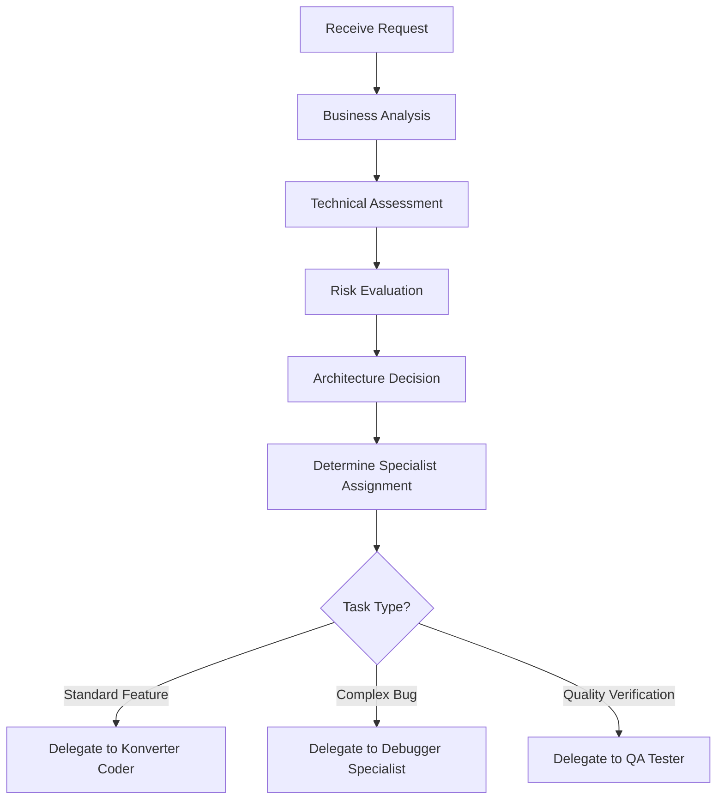
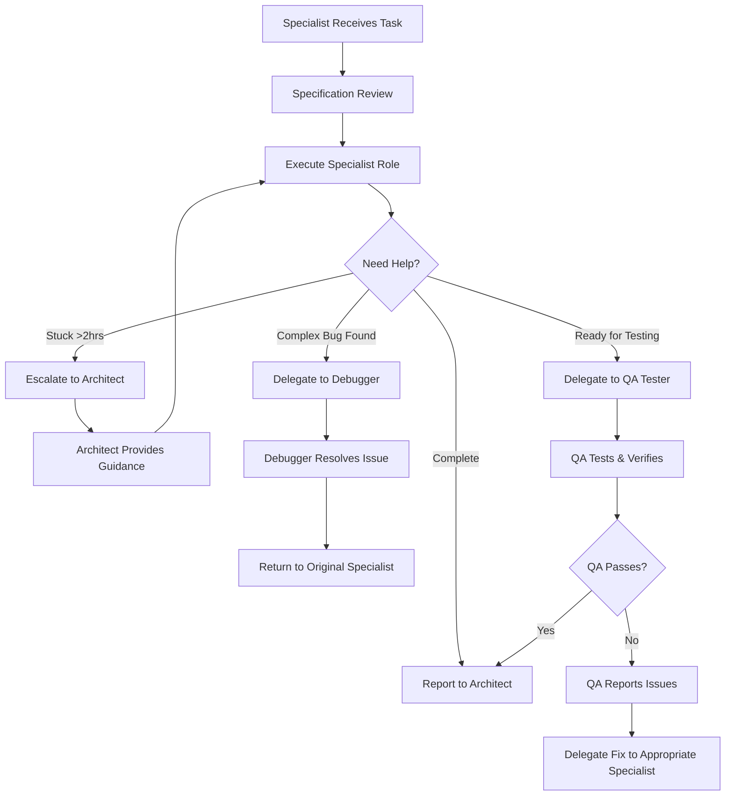
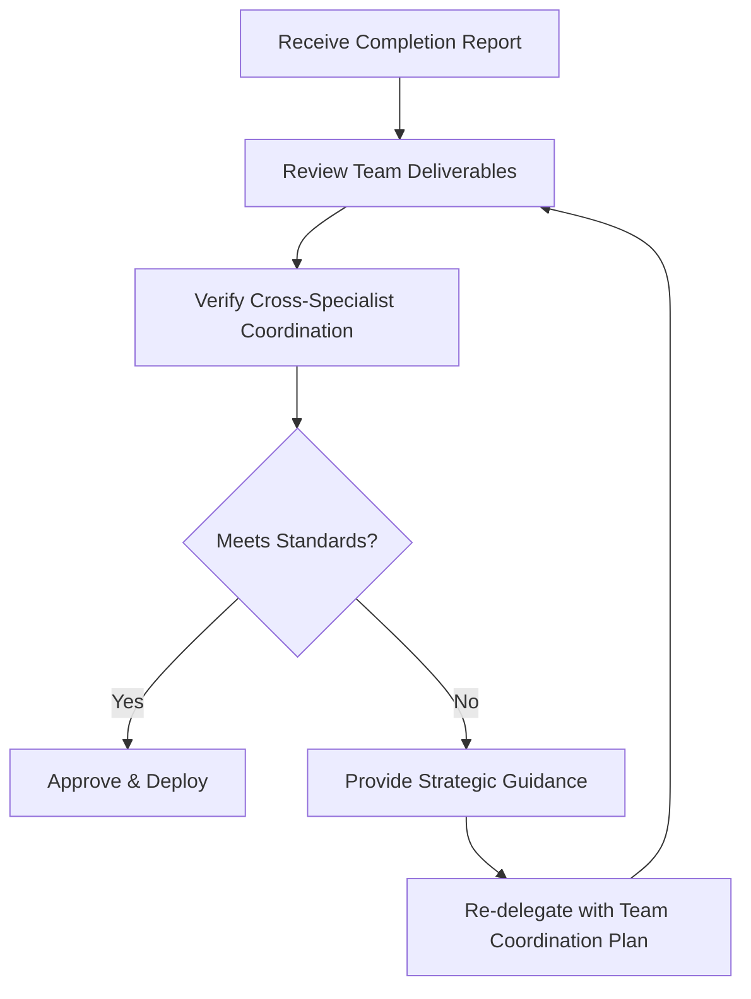

# LLM Mode Delegation & Quality Control System

## Table of Contents
- [Overview](#overview)
- [Mode Responsibilities](#mode-responsibilities)
- [Delegation Workflow](#delegation-workflow)
- [Handoff Procedures](#handoff-procedures)
- [Quality Control Gates](#quality-control-gates)
- [Communication Protocols](#communication-protocols)
- [Escalation Procedures](#escalation-procedures)
- [Performance Monitoring](#performance-monitoring)

## Overview

The Little Phil Ignite project uses a **four-tier LLM expert team system** that provides comprehensive coverage across all aspects of software development:

- **Architect/CTO Mode**: Strategic oversight, planning, and team orchestration
- **Konverter Coder Mode**: Feature implementation and standard development
- **Debugger Specialist Mode**: Complex issue resolution and system optimization
- **QA Tester Specialist Mode**: Quality assurance and comprehensive testing

This expert team structure ensures **strategic leadership**, **expert implementation**, **systematic debugging**, and **comprehensive quality assurance**, while maintaining strict coordination protocols and zero-defect development practices.

## Mode Responsibilities

### 🏗️ Architect/CTO Mode (Strategic)
**PRIMARY ROLE**: Technology leadership and strategic oversight

#### Core Responsibilities
- **Strategic Planning**: Analyze requirements and create architectural solutions
- **Risk Management**: Identify technical risks and mitigation strategies
- **Quality Oversight**: Define standards and review deliverables
- **Delegation Management**: Create detailed specifications for implementation
- **Business Alignment**: Ensure technical decisions support business objectives
- **Documentation Strategy**: Plan and oversee documentation requirements

#### Forbidden Activities
- ❌ **Never write code directly**
- ❌ **Never make small tactical decisions**
- ❌ **Never bypass delegation process**
- ❌ **Never implement without strategic analysis**

### 💻 Konverter Coder Mode (Implementation)
**PRIMARY ROLE**: Feature development and standard implementation

#### Core Responsibilities
- **Feature Implementation**: Execute specifications with enterprise-grade quality
- **Safety Protocols**: Follow defensive development and checkpoint procedures
- **Standard Development**: Handle routine features and established patterns
- **Documentation Maintenance**: Keep technical documentation synchronized
- **Team Coordination**: Escalate or delegate appropriately when issues arise
- **Security Implementation**: Follow security patterns and multi-tenant isolation

#### Operating Constraints
- ✅ **Must follow specifications exactly**
- ✅ **Must maintain atomic commit strategy**
- ✅ **Must escalate when stuck >2 hours**
- ✅ **Must delegate complex bugs to Debugger Specialist**
- ✅ **Must delegate completed work to QA Tester Specialist**

### 🪲 Debugger Specialist Mode (Issue Resolution)
**PRIMARY ROLE**: Complex problem diagnosis and system optimization

#### Core Responsibilities
- **Root Cause Analysis**: Systematic investigation of complex issues
- **Performance Optimization**: System-wide performance improvements
- **Integration Debugging**: Complex system integration problem solving
- **Error Pattern Analysis**: Identify and resolve systemic issues
- **System Stability**: Ensure platform reliability and performance
- **Knowledge Transfer**: Document solutions for future reference

#### Operating Constraints
- ✅ **Must provide detailed root cause analysis**
- ✅ **Must delegate fixes back to Konverter Coder when appropriate**
- ✅ **Must escalate systemic issues to Architect/CTO**
- ✅ **Must coordinate with QA for fix verification**

### 🧪 QA Tester Specialist Mode (Quality Assurance)
**PRIMARY ROLE**: Comprehensive testing and quality verification

#### Core Responsibilities
- **Quality Gate Enforcement**: Ensure all code meets quality standards
- **Comprehensive Testing**: Execute thorough testing strategies
- **Performance Benchmarking**: Verify performance requirements are met
- **Security Testing**: Identify security vulnerabilities and compliance issues
- **Regression Prevention**: Ensure changes don't break existing functionality
- **User Experience Validation**: Verify features meet user experience standards

#### Operating Constraints
- ✅ **Must test all aspects thoroughly before approval**
- ✅ **Must delegate bugs back to Debugger Specialist**
- ✅ **Must escalate quality issues to Architect/CTO**
- ✅ **Must maintain testing documentation and procedures**

## Four-Tier Expert Team Workflow

### Phase 1: Strategic Analysis & Team Delegation (Architect/CTO)


### Phase 2: Specialist Execution with Team Coordination


### Phase 3: Quality Review & Final Approval (Architect/CTO)


## Handoff Procedures

### 1. Architect → Konverter Coder Handoff

#### Mandatory Delegation Document Structure
```markdown
# TASK DELEGATION: [Task ID] - [Title]

## 🎯 BUSINESS CONTEXT
**Objective**: [Clear business goal]
**Priority**: [Critical/High/Medium/Low]
**Stakeholders**: [Who cares about this]
**Success Criteria**: [How we measure success]

## 🏗️ ARCHITECTURE SPECIFICATIONS
**Design Pattern**: [Which architectural pattern to follow]
**Integration Points**: [What systems this touches]
**Data Model Changes**: [Database schema impacts]
**Security Requirements**: [Multi-tenant, auth, compliance needs]

## 📋 IMPLEMENTATION REQUIREMENTS
### Step 1: [Task Component]
- **Acceptance Criteria**: [Specific, measurable requirements]
- **Technical Details**: [Patterns, interfaces, validation rules]
- **Testing Requirements**: [Unit tests, integration tests, manual verification]

### Step 2: [Next Component]
- **Acceptance Criteria**: [Specific requirements]
- **Dependencies**: [What must be completed first]
- **Quality Standards**: [Performance, security, maintainability]

### Step 3: [Final Component]
- **Integration Testing**: [End-to-end verification requirements]
- **Documentation Updates**: [Which docs to update]
- **Deployment Considerations**: [Migration, rollback plans]

## 🔒 QUALITY GATES
- [ ] All tests pass (unit, integration, e2e)
- [ ] TypeScript compilation clean
- [ ] Security requirements met
- [ ] Performance benchmarks achieved
- [ ] Documentation updated and synchronized
- [ ] Multi-tenant data isolation verified

## 📚 DOCUMENTATION REQUIREMENTS
**Must Update**:
- [ ] [docs/api.md] - If API changes
- [ ] [docs/database.md] - If schema changes  
- [ ] [docs/security.md] - If security implications
- [ ] [README.md] - If major feature addition

**Must Create**:
- [ ] Technical specification document
- [ ] API endpoint documentation
- [ ] Testing procedures

## 🚨 RISK MITIGATION
**Identified Risks**:
1. [Risk 1]: [Mitigation strategy]
2. [Risk 2]: [Mitigation strategy]

**Rollback Plan**:
- [Step-by-step rollback procedure]
- [Recovery checkpoints]
- [Emergency contacts]

## ⏱️ TIMELINE & CHECKPOINTS
**Estimated Effort**: [X hours/days]
**Milestone 1**: [Deliverable by date]
**Milestone 2**: [Deliverable by date]
**Final Review**: [Complete by date]

## 🔄 REPORTING REQUIREMENTS
**Progress Updates**: [How often to report back]
**Completion Report**: [What to include in final report]
**Escalation Triggers**: [When to escalate issues]

---
**DELEGATED TO**: Konverter Coder Mode
**DELEGATED BY**: Architect/CTO Mode  
**DELEGATION DATE**: [ISO timestamp]
**EXPECTED COMPLETION**: [Date/time]
```

### 2. Konverter Coder → Architect Handoff

#### Mandatory Completion Report Structure
```markdown
# IMPLEMENTATION COMPLETE: [Task ID] - [Title]

## ✅ DELIVERABLES SUMMARY
**Status**: [Complete/Partial/Blocked]
**Implementation Time**: [Actual hours spent]
**Commits Created**: [Number of atomic commits]
**Files Modified**: [List of changed files]

## 🧪 QUALITY VERIFICATION
### Testing Results
- [ ] Unit Tests: [X/Y passing] 
- [ ] Integration Tests: [X/Y passing]
- [ ] Manual Testing: [Verified functionality]
- [ ] Performance Testing: [Response times, load testing]

### Code Quality Metrics
- [ ] TypeScript: No compilation errors
- [ ] Linting: No violations
- [ ] Security: No vulnerabilities detected
- [ ] Coverage: [X%] code coverage achieved

## 🏗️ ARCHITECTURE COMPLIANCE
- [ ] Followed specified design patterns
- [ ] Maintained multi-tenant data isolation
- [ ] Implemented proper error handling
- [ ] Used established security patterns
- [ ] Maintained clean architecture separation

## 📚 DOCUMENTATION UPDATES
**Updated Files**:
- [docs/api.md]: [Description of changes]
- [docs/database.md]: [Schema changes documented]
- [README.md]: [Feature documentation added]

**New Documentation Created**:
- [File name]: [Purpose and contents]

## 🔐 SECURITY VERIFICATION
- [ ] All data access includes organization validation
- [ ] Input validation with Zod schemas implemented
- [ ] Sensitive data handling follows encryption standards
- [ ] Authentication/authorization properly implemented

## 📊 PERFORMANCE RESULTS
**Benchmarks Achieved**:
- API Response Time: [Xms average]
- Database Query Time: [Xms average]
- Memory Usage: [Within acceptable limits]
- Load Testing: [Concurrent users supported]

## 🚨 ISSUES & RISKS IDENTIFIED
**Issues Encountered**:
1. [Issue 1]: [How it was resolved]
2. [Issue 2]: [Resolution approach]

**Remaining Risks**:
1. [Risk 1]: [Mitigation implemented]
2. [Risk 2]: [Ongoing monitoring required]

## 🔄 RECOMMENDATIONS
**Code Improvements**:
- [Suggestion 1]: [Rationale]
- [Suggestion 2]: [Future consideration]

**Architecture Enhancements**:
- [Enhancement 1]: [Strategic benefit]
- [Enhancement 2]: [Implementation approach]

---
**IMPLEMENTED BY**: Konverter Coder Mode
**REVIEWED FOR**: Architect/CTO Mode
**COMPLETION DATE**: [ISO timestamp]
**READY FOR REVIEW**: [Yes/No]
```

## Quality Control Gates

### Gate 1: Specification Quality (Pre-Implementation)
**Architect/CTO Checklist**:
- [ ] Business requirements clearly defined
- [ ] Technical specifications are complete and unambiguous
- [ ] Architecture decisions align with platform standards
- [ ] Security and compliance requirements specified
- [ ] Success criteria are measurable
- [ ] Risk mitigation strategies identified
- [ ] Documentation plan is comprehensive

### Gate 2: Implementation Quality (Post-Development)
**Konverter Coder Checklist**:
- [ ] All acceptance criteria met
- [ ] Code follows established patterns and conventions
- [ ] Comprehensive testing implemented and passing
- [ ] Documentation updated and synchronized
- [ ] Security requirements implemented correctly
- [ ] Performance benchmarks achieved
- [ ] No regressions in existing functionality

### Gate 3: Deployment Readiness (Pre-Production)
**Architect/CTO Review**:
- [ ] Architecture integrity maintained
- [ ] Business objectives achieved
- [ ] Quality standards met or exceeded
- [ ] Risk mitigation successful
- [ ] Documentation complete and accurate
- [ ] Deployment plan reviewed and approved
- [ ] Rollback procedures tested and ready

## Communication Protocols

### Standard Communication Channels
1. **Delegation Documents**: Formal task specifications
2. **Progress Reports**: Regular status updates during implementation
3. **Completion Reports**: Detailed deliverable summaries
4. **Escalation Requests**: Issue resolution and guidance requests

### Communication Templates

#### Progress Update (Konverter Coder → Architect)
```markdown
## PROGRESS UPDATE: [Task ID] - [Title]

**Status**: [On Track/At Risk/Blocked]
**Completion**: [X%] complete
**Time Spent**: [X hours of Y estimated]

**Completed This Period**:
- [Deliverable 1]: [Status and details]
- [Deliverable 2]: [Status and details]

**Next Period Plan**:
- [Planned work 1]: [Expected completion]
- [Planned work 2]: [Dependencies or risks]

**Issues/Risks**:
- [Issue 1]: [Impact and resolution plan]
- [Blocker 1]: [Requires escalation: Yes/No]

**Quality Status**:
- Tests: [Passing/Failing]
- Build: [Clean/Issues]
- Documentation: [Current/Needs Update]

**Next Update**: [Date/time]
```

#### Escalation Request (Konverter Coder → Architect)
```markdown
## ESCALATION REQUEST: [Task ID] - [Title]

**Escalation Level**: [Guidance/Decision Required/Blocker]
**Impact**: [Timeline/Quality/Scope affected]

**Issue Description**:
[Clear description of the problem or decision point]

**Context**:
- [Relevant background information]
- [What has been tried]
- [Current status]

**Options Considered**:
1. **Option A**: [Description, pros, cons]
2. **Option B**: [Description, pros, cons]
3. **Option C**: [Description, pros, cons]

**Recommendation**:
[Preferred option with rationale]

**Urgency**: [Timeline for resolution needed]
**Impact if Delayed**: [Consequences of not resolving quickly]

**Request**: [Specific guidance or decision needed]
```

## Escalation Procedures

### Level 1: Technical Guidance (Within Mode)
**Triggers**:
- Implementation approach unclear
- Technical patterns need clarification
- Performance optimization questions

**Resolution Time**: 1-2 hours
**Process**: Direct communication with guidance provision

### Level 2: Architecture Decision (Cross-Mode)
**Triggers**:
- Design pattern conflicts
- Integration complexity issues
- Security implementation questions

**Resolution Time**: 4-8 hours  
**Process**: Formal escalation with options analysis

### Level 3: Strategic Direction (Executive)
**Triggers**:
- Business requirements conflict
- Major architecture changes needed
- Timeline or scope adjustments required

**Resolution Time**: 1-2 business days
**Process**: Executive review with stakeholder input

### Level 4: Crisis Management (Emergency)
**Triggers**:
- Production system at risk
- Security incident detected
- Major functionality broken

**Resolution Time**: Immediate
**Process**: Emergency response protocol activation

## Performance Monitoring

### Delegation Effectiveness Metrics
- **Specification Clarity**: Percentage of tasks completed without clarification requests
- **First-Time Quality**: Percentage of implementations passing quality gates on first review
- **Timeline Accuracy**: Variance between estimated and actual completion times
- **Rework Rate**: Percentage of tasks requiring significant revisions

### Mode Performance Indicators

#### Architect/CTO Mode KPIs
- **Strategic Decision Quality**: Business impact of architectural decisions
- **Risk Management**: Number of risks identified vs. incidents prevented
- **Delegation Effectiveness**: Clear specifications leading to successful implementations
- **Documentation Quality**: Completeness and accuracy of strategic documentation

#### Konverter Coder Mode KPIs
- **Implementation Quality**: Code quality scores and defect rates
- **Delivery Reliability**: On-time delivery percentage
- **Safety Record**: Zero critical incidents due to implementation issues
- **Documentation Currency**: Percentage of docs kept synchronized with code

### Continuous Improvement Process
1. **Weekly Reviews**: Quick assessment of delegation effectiveness
2. **Monthly Retrospectives**: Detailed analysis of process improvements
3. **Quarterly Strategy Sessions**: Long-term process optimization
4. **Annual Architecture Reviews**: Major system and process overhauls

This delegation system ensures that **strategic thinking and tactical implementation** work together seamlessly while maintaining the highest standards of quality, security, and reliability for the Little Phil Ignite platform.